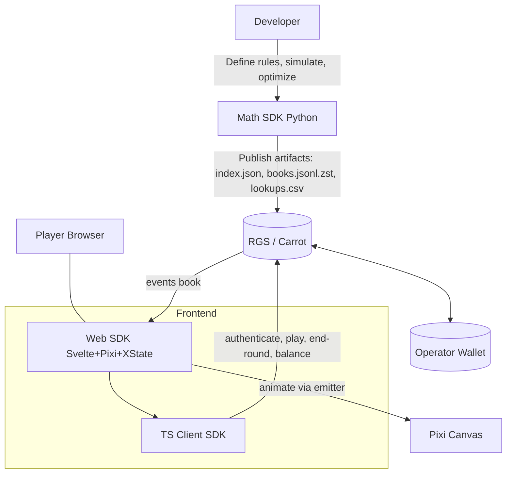
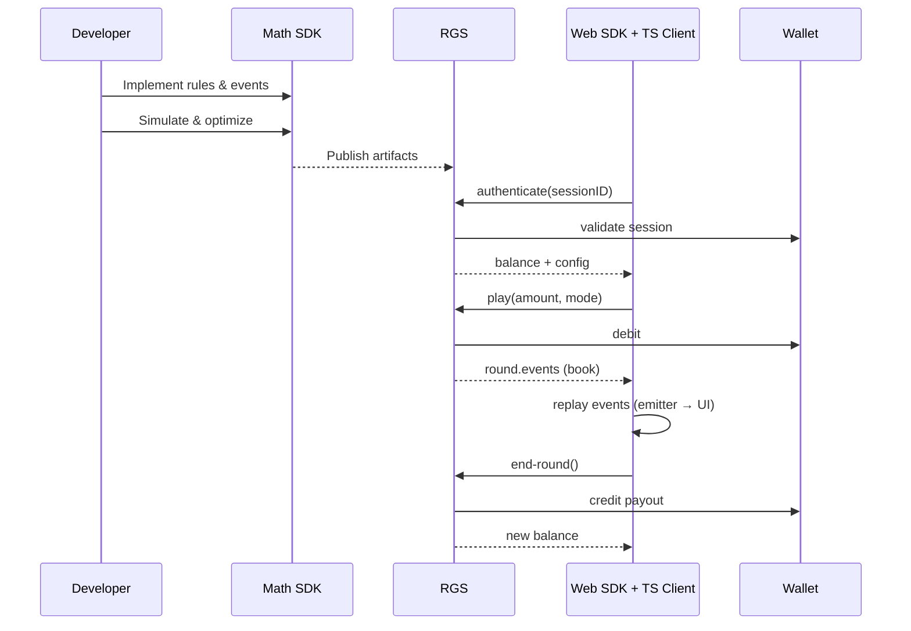

# 🎰 STAKE ENGINE – COMPLETE TECHNICAL DOCUMENTATION

---

## 📋 TABLE OF CONTENTS

1. [Overview & Architecture](#overview--architecture)
2. [Math SDK (Python)](#math-sdk-python)
3. [Web SDK (Svelte + PixiJS + XState)](#web-sdk-svelte--pixijs--xstate)
4. [TypeScript Client SDK](#typescript-client-sdk)
5. [RGS (Remote Gaming Server)](#rgs-remote-gaming-server)
6. [End-to-End Workflow](#end-to-end-workflow)
7. [Security & Compliance](#security--compliance)
8. [Key Data Structures](#key-data-structures)
9. [Deployment Checklist](#deployment-checklist)
10. [Quick-Start Guides](#quick-start-guides)
11. [Glossary](#glossary)

---

## 🎯 OVERVIEW & ARCHITECTURE

### What is Stake Engine?

Stake Engine is an **end-to-end platform for developing iGaming games** (specifically slots, crash games, and variants). The platform provides:

1. **Math SDK** (Python 3.12+) – Define game logic, simulate outcomes, optimize distributions
2. **Web SDK** (Svelte/PixiJS) – Frontend UI/rendering for games
3. **TypeScript Client** (NPM) – Integration with RGS API
4. **RGS (Remote Gaming Server)** – Backend that manages sessions, bets, payouts

### Architecture Overview



### Component Responsibilities

```
Developer (You)
  ↓
1. Math SDK (Python)
   ├── Define game rules
   ├── Simulate N rounds
   ├── Optimize win distributions
   └── Output: CSV + JSON.zst files
  ↓
2. RGS Backend (Stake Engine hosted)
   ├── Stores game files
   ├── Manages sessions
   ├── Processes bets
   └── Selects outcomes deterministically
  ↓
3. Web SDK (Svelte/PixiJS)
   ├── Frontend UI
   ├── TypeScript Client integration
   └── Renders game visuals
  ↓
4. Player Browser
   └── Play game, win/lose, repeat
```

| Component | Responsibilities |
|-----------|-----------------|
| **Math SDK (Python)** | Define game rules, simulate large volumes, record step-by-step **events**, produce **books** and **lookup tables**, run weight optimization to target RTP/volatility, generate **publishable artifacts** |
| **RGS** | Host game assets (CDN) + math artifacts, validate session, **debit wager / credit win** via Wallet, **select outcome** using lookup weights, return **event list** to client, persist partial rounds for stateful games |
| **TS Client SDK** | Typed, ergonomic API: `authenticate`, `play`, `endRound`, `balance`, `endEvent`, `forceResult` (dev). Handles URL/session, integer money conversion, error mapping |
| **Web SDK** | Render UI with Svelte + Pixi (WebGL). Drive a **client state machine** (XState). Consume **book events** → broadcast **UI emitter events** → components react (HUD, reels, counters, animations) |

---

## 🐍 MATH SDK (PYTHON)

**GitHub:** https://github.com/StakeEngine/math-sdk  
**Language:** Python 85.6%, Rust 14.1%, Makefile 0.3%  
**Requirements:** Python 3.12+, PIP package manager, Rust/Cargo (for optimization)

### Purpose

The Math SDK is a **Python-based engine for**:
- Defining game rules (symbols, paylines, features)
- Simulating game outcomes (100k-500k+ spins)
- Optimizing win distributions to hit RTP targets
- Generating output files for backend deployment

### Installation

```bash
# Clone the repository
git clone https://github.com/StakeEngine/math-sdk
cd math-sdk

# Setup using Make (recommended)
make setup

# Alternative: Manual setup
python -m venv venv
source venv/bin/activate  # Windows: venv\Scripts\activate
pip install -r requirements.txt
```

### File Structure & Core Concepts

- **Game config** (`game_config.py`): paytable, symbols (regular, wild, scatter), reelstrips per mode (e.g., base/free), scatter triggers (e.g., 3 scatters → 10 FS), **BetModes** (BASE, BONUSBUY…), cost multipliers, limits
- **Executables**: functions/classes that **generate boards**, evaluate wins (lines/ways), cascades (tumble), multipliers, feature triggers; **emit events** (JSON) step-by-step (reveal, winInfo, setTotalWin, finalWin, …)
- **Outputs** (per BetMode):
  - **Books** (`books_<mode>.jsonl[.zst]`): each line = one simulation → `{ id, payoutMultiplier, events[] }`
  - **Lookup tables** (`lookUpTable_<mode>.csv`): `id, weight, payoutMultiplier` (weights optimized to hit target RTP)
  - **Force files** (`force_record_<mode>.json`, `force.json`): structured indices of custom-recorded events to find/force outcomes for QA
  - **Index (`index.json`)**: manifest for RGS (hashes, paths)

**Events** are the universal language across the stack: they precisely describe the round timeline. The Web SDK never "recalculates" math; it **replays** events visually.

### Key Concepts

#### GameState (Central Class)

The heart of the Math SDK. Manages:
- **Configuration:** Symbol probabilities, reel strips, payline definitions
- **Simulations:** Running N game rounds (spin generation)
- **Win Evaluation:** Checking 243 ways, calculating multipliers
- **Feature Logic:** Free spins, respin, bonus triggers
- **Output Generation:** events[] and payoutMultiplier calculation

#### Symbols

- **Definition:** Name, ID, payouts per match count, special properties
- **Types:** Regular, Wild, Scatter, Bonus
- **Payouts:** Dictionary mapping {num_symbols: multiplier}
- **Example:**
  ```python
  regular: ["A","K","Q","J","10","9"]
  wild: ["W"]
  scatter: ["S"]
  ```
- Optional attributes (sticky, stacked, expanding…)

#### Reelstrips

- **Purpose:** Weighted symbol distributions per reel
- **Format:** List of (symbol_id, weight) tuples
- **Usage:** Random selection from weighted reel strips during spin generation
- Per mode and per "strip set" (e.g., BR0, BR1) with weighted selection to shape frequency/volatility

#### Paytable

- **Definition:** Win amounts for symbol combinations
- **Calculation:** symbol_payout × num_matching × bet_amount
- **Scope:** Base game and feature modes
- Map (count, symbol) → payout (as multiplier)
- Provide helpers to define ranges (e.g., 3–5 of kind pay same bucket)

#### Distributions

- **Purpose:** Categorize spins by outcome (0×, 1×-5×, 5×-25×, etc.)
- **Quota:** Percentage of spins in each bucket
- **Goal:** Match RTP target through bucket weights
- Named **criteria** with **quota** and optional **conditions** (e.g., `force_freegame`, `force_wincap`, `reel_weights`), plus optional **win_criteria** (e.g., exact max-win)
- The simulator samples until criteria are satisfied (discarding misses), ensuring rare but needed outcomes exist in the books

### BetModes & Scatter Triggers

- **BetMode**: encapsulates **cost multiplier**, reel regimes, features
- **Scatter triggers**: (e.g., 3S → 10FS, 4S → 15FS, …). Free game may swap reelstrips and add bonus rules
- Example triggers: 3 scatters → 10 Free Spins

### Output Files Generated

#### 1. weights_<mode>.csv

```csv
id,probability,payoutMultiplier
100001,000000000120,0
100002,000000000087,1.5
100003,000000000045,5.0
...
```

- **id:** Unique book identifier
- **probability:** uint64 weight (higher = more likely RGS selects this)
- **payoutMultiplier:** Final payout as multiplier of bet

#### 2. events_<mode>.jsonl.zst

```json
One JSON per line, compressed with Zstandard:
{"id": 100001, "payoutMultiplier": 1.5, "events": [
  {"type": "spinStart", "bet": 1000000, "mode": "classic"},
  {"type": "reelStop", "reel": 1, "symbols": ["A", "W2", "E"]},
  ...
]}
```

- **Line count:** = total books (e.g., 100k lines for 100k spins)
- **Compression:** .zst reduces file size ~70%
- **1:1 Match:** payoutMultiplier must match CSV exactly

#### 3. index.json

```json
{
  "modes": [
    {
      "name": "classic",
      "costMultiplier": 1,
      "events": "events_classic.jsonl.zst",
      "weights": "weights_classic.csv"
    },
    {
      "name": "freedom",
      "costMultiplier": 2,
      "events": "events_freedom.jsonl.zst",
      "weights": "weights_freedom.csv"
    }
  ]
}
```

- **Purpose:** Registry of all game modes
- **RGS Requirement:** RGS reads this to locate game files
- **Flexibility:** Can have 1+ modes with different RTP/probabilities

### Recording & Force Files

- Call `record({...})` during simulation to log custom markers (e.g., "5 scatters", "x500+ win")
- Consolidated at the end into `force_record_<mode>.json` (frequency + list of IDs) and a cross-mode `force.json` index
- Used by **RGS dev tools** / `forceResult` to find or constrain outcomes during QA

### Usage Workflow

```python
# 1. Import game config
from games.merica import GameConfig, MuricaGameState

# 2. Initialize
config = GameConfig()
game = MuricaGameState(config)

# 3. Simulate spins
for i in range(100000):
    result = game.spin(mode='classic')
    # result contains: grid, wins, events, payoutMultiplier

# 4. Export
export_to_csv(weights, mode='classic')
export_to_jsonl_zst(events, mode='classic')
export_index_json()
```

### Running Simulations

```bash
# Small, legible JSON for local inspection
make run GAME=0_0_lines DEBUG=1

# Production-scale with compression, multi-thread, optimization
make run GAME=0_0_lines THREADS=20 OPTIMIZE=1 PUBLISH=1
```

**Available Makefile Commands:**
```makefile
make setup              # Install Python env + deps
make install           # Install deps only
make simulate          # Run simulations
make export-classic    # Generate classic mode files
make export-freedom    # Generate freedom mode files
make clean             # Remove cache
```

### Optimization (Weights → Target RTP/Shape)

- After raw sims (default weight=1), an optimizer adjusts **lookup weights** per ID so that weighted RTP matches the target and the **distribution shape** (base vs feature contribution, medium wins frequency, etc.)
- Output: optimized `lookUpTable_<mode>_*.csv` and optionally diagnostics (diffs, RTP breakdowns)
- Tune knobs: thread count, sims per mode, compression on/off, optimization on/off, analysis on/off

### Analysis (PAR Sheet)

- Generate spreadsheets/plots: hit rate, FS trigger rate, win bands, average wins by bucket, contributions (base vs feature), max-win incidence, etc.
- Validate product & compliance expectations **before** publishing

### Publishable Artifacts

The RGS expects:
- `index.json` (paths + digests)
- `lookUpTable_*.csv` (optimized)
- `books_*.jsonl.zst` (events)
- Hashes must match; formats must be exact. The Math SDK emits fully compliant bundles

---

## 🌐 WEB SDK (SVELTE + PIXIJS + XSTATE)

**GitHub:** https://github.com/StakeEngine/web-sdk  
**Stack:**
- **Framework:** Svelte 5.x + SvelteKit (or Vite)
- **Rendering:** PixiJS 8.14 (WebGL 2D)
- **State:** XState 5.24 (state machine)
- **Audio:** Howler.js 2.2
- **Build:** Vite 7.1
- **Package Manager:** pnpm 10.5+

### Purpose

Provides frontend UI/UX for:
- Reel rendering and animation
- Button controls (Spin, Bet +/−)
- HUD displays (Balance, Win, Bet)
- Settings/Info panels
- Integration with TypeScript RGS Client

### Installation

```bash
git clone https://github.com/StakeEngine/web-sdk
cd web-sdk

# Install dependencies
pnpm install

# Development server
pnpm dev

# Production build
pnpm build
```

### Project Structure

```
/web-sdk
├── /src
│   ├── /rgs
│   │   ├── client.ts          # RGS API calls
│   │   └── types.ts           # TypeScript interfaces
│   ├── /events
│   │   ├── emitter.ts         # SimpleEmitter class
│   │   └── bookEventHandlerMap.ts  # Event handlers
│   ├── /stage
│   │   └── createStage.ts     # PixiJS setup
│   ├── /audio
│   │   └── sfx.ts             # Sound effects (Howler.js)
│   ├── /ui
│   │   ├── Hud.svelte         # Balance, Bet, Spin button
│   │   ├── Paytable.svelte    # Info/Rules panel
│   │   └── Settings.svelte    # Audio, Turbo, etc
│   ├── App.svelte             # Root component
│   └── main.ts                # Vite entry
├── /static
│   ├── /symbols               # Icon/sprite images
│   ├── /backgrounds           # Reel frames
│   └── /sounds                # SFX + BGM files
└── package.json / vite.config.ts / svelte.config.js
```

### Core Concepts

#### Contexts & Responsive Layout

- Global contexts: `EventEmitter`, `XState actor`, `Layout`, `App/Game data`; injected via Svelte context
- Layout exposes canvas sizes/aspect; components bind to it for **responsive** positioning/scaling (portrait/landscape swaps)

#### RGS Client (client.ts)

Handles all communication with Stake Engine RGS:

```typescript
// authenticate() – Get session, balance, config
await authenticate(sessionID);
// Returns: { balance, minBet, maxBet, stepBet, config, round }

// play() – Place bet, receive outcome
await play({ bet: 1000000, mode: 'classic' });
// Returns: { round: { events: BookEvent[], ... } }

// endRound() – Close active round, confirm payout
await endRound({ roundId });
// Returns: { balance }
```

#### Event-Driven Pipeline (Book → Emitter → UI)

1. **playBookEvents(events[])** iterates **in order** through book events
2. Each book event is handled by **`bookEventHandlerMap[type]`** (async function)
3. Handler **broadcasts** UI intents via `eventEmitter` (synchronous `broadcast` or awaitable `broadcastAsync`)
4. Components **subscribe** and react (animate reels, update counters, show wins)

**Example – handler → emitter events:**
```typescript
const bookEventHandlerMap = {
  updateFreeSpin: async (ev) => {
    eventEmitter.broadcast({ type: "freeSpinCounterShow" });
    await eventEmitter.broadcastAsync({
      type: "freeSpinCounterUpdate",
      current: ev.amount,
      total: ev.total
    });
  },
  reveal: async (ev) => {
    // tell reels to stop at given symbols for each column
    await eventEmitter.broadcastAsync({ type: "reelsStop", board: ev.board });
  },
  setTotalWin: async (ev) => {
    await eventEmitter.broadcastAsync({ type: "winCounterTo", amount: ev.amount });
  },
  finalWin: async (ev) => {
    eventEmitter.broadcast({ type: "roundComplete", amount: ev.amount });
  }
};
```

#### BookEvents (bookEventHandlerMap.ts)

Deterministic sequence of game events:

```typescript
type BookEvent =
  | { type: 'spinStart'; bet: number; mode: string }
  | { type: 'reelStop'; reel: 1|2|3|4|5; symbols: string[] }
  | { type: 'waysWin'; ways: {symbol, reels, mult, win}[] }
  | { type: 'setTotalWin'; amount: number }
  | { type: 'finalWin' }
  | { type: 'fsStart'; totalSpins: number }
  | { type: 'stickyWildAdd'; reel: number; row: number; mult: number }
  | { type: 'hypeUp'; value: number }
  | { type: 'fsEnd'; totalWin: number }
  | { type: 'respinStart' }
  | { type: 'reelLock'; reels: number[] }
  | { type: 'respinEnd' };

// Handler map:
bookEventHandlerMap = {
  spinStart: async (evt) => { /* lock UI, play sound */ },
  reelStop: async (evt) => { /* animate reel */ },
  waysWin: async (evt) => { /* highlight wins */ },
  setTotalWin: async (evt) => { /* count-up animation */ },
  // ... etc
};
```

**Example – component subscription (Svelte script):**
```typescript
onMount(() => {
  const unsub = context.eventEmitter.subscribe({
    reelsStop: async ({ board }) => {
      await animateReelsTo(board); // resolve when animation ends
    },
    winCounterTo: async ({ amount }) => {
      await tweenCounterTo(amount);
    },
    freeSpinCounterShow: () => visible = true,
    freeSpinCounterUpdate: ({ current, total }) => { cur = current; tot = total; },
    roundComplete: ({ amount }) => showSummary(amount)
  });
  return () => unsub();
});
```

#### PixiJS Stage (createStage.ts)

WebGL rendering layer:
- Create Application instance
- Build 5 reels (Containers)
- Render 15 cells (5×3 grid)
- Handle spin animations (position/rotation)
- Manage particle effects

#### Svelte Components (UI)

- **Hud.svelte:** Shows balance, win amount, bet controls, spin button
- **Paytable.svelte:** Display symbol payouts, RTP, rules
- **Settings.svelte:** Volume, Turbo mode, Night skin toggles

#### State Machine (XState)

Game states:
```
idle → spinning → resolving → ready
           ↓
       (error)
           ↓
         idle
```

Substates for features (Free Spins, Respin).

### UI/UX Concerns

- **HUD**: balance, bet, last win; lock inputs during `rendering` state
- **Autoplay**: after `roundComplete`, re-trigger play until stop rules (count, stop on win/feature, stop under/over balance)
- **Turbo**: time-scale or skip nonessential animations; wire via a global flag in context
- **Feature modes**: when events switch `gameType` to freegame, present transitions and feature-specific overlays
- **"Big Win" tiers**: emit tiered events to layer SFX, VFX, and counters

### Configuration (package.json)

```json
{
  "dependencies": {
    "pixi.js": "^8.14.0",
    "svelte": "^5.39.6",
    "xstate": "^5.24.0",
    "howler": "^2.2.4"
  },
  "devDependencies": {
    "vite": "^7.1.7",
    "@sveltejs/vite-plugin-svelte": "^6.2.1",
    "typescript": "~5.9.3"
  }
}
```

---

## 📦 TYPESCRIPT CLIENT SDK

**GitHub:** https://github.com/StakeEngine/ts-client  
**Package:** Available as npm module `stake-engine`  
**Language:** TypeScript (compiled to JavaScript)

### Purpose

Lightweight TypeScript wrapper around RGS API endpoints. Provides:
- Type-safe API calls
- Session management
- Event emission
- Error handling

### Installation

```bash
npm install stake-engine
```

### Basic Usage

```typescript
import { RGSClient } from 'stake-engine';

// Initialize
const client = new RGSClient({
  rgsUrl: 'https://rgs.example.com',
  sessionID: 'user-session-123'
});

// Authenticate
const authResult = await client.authenticate();
console.log(authResult.balance);  // Current balance

// Play
const playResult = await client.play({
  bet: 1000000,           // In smallest currency unit (e.g., cents)
  mode: 'classic'         // Game mode from index.json
});
const events = playResult.round.events;  // Array of BookEvents

// End round
await client.endRound({ roundId: playResult.round.id });

// Listen to events
client.on('balanceUpdate', (newBalance) => {
  console.log('New balance:', newBalance);
});
```

### Core Methods

```typescript
// Derives session/rgsUrl/lang from URL query in browsers if omitted
const auth = await requestAuthenticate({ sessionID?, rgsUrl?, language? });

const play = await requestBet({
  amount,   // number (e.g., 1.00) → auto-converted to int with 6 dp
  mode      // "BASE", "BONUSBUY", etc.
});

const ended = await requestEndRound();      // credit pending win, close round
const bal   = await requestBalance();       // get current balance

// Stateful games (multi-step decisions during a single round)
await requestEndEvent({ eventIndex, payload? });

// Dev-only: find/force outcomes by custom criteria (from force files)
const forced = await requestForceResult({ criteria });
```

### API Methods

#### authenticate()

```typescript
POST /wallet/authenticate
{
  sessionID: string
}
Response:
{
  balance: number,
  currency?: string,
  minBet?: number,
  maxBet?: number,
  stepBet?: number,
  config?: GameConfig,
  round?: RoundData
}
```

#### play()

```typescript
POST /wallet/play
{
  bet: number,
  mode: string
}
Response:
{
  round: {
    id: string,
    events: BookEvent[],
    payoutMultiplier: number
  },
  balance: number
}
```

#### endRound()

```typescript
POST /wallet/end-round
{
  roundId: string
}
Response:
{
  balance: number,
  success: boolean
}
```

### Responses (Shapes)

- **Authenticate** → `{ balance, config, round? }`
  - `balance`: `{ amount: integer, currency: string }`
  - `config`: `{ minBet, maxBet, stepBet, defaultBetLevel, betLevels[], jurisdiction? }`
  - `round?`: present if there is a pending/partial round to resume

- **Play** → `{ balance, round }` (balance is **post-bet**, pre-payout)
  - `round.events[]`: the full book event list to render

- **EndRound** → `{ balance }` (balance includes credited payout)

### Errors

- Insufficient balance, invalid session, out-of-range bet, invalid mode, geo restrictions, etc.
- Map errors to UI toasts/states and retry flows (e.g., re-authenticate on expired session)

### Typical Front-End Flow (using Client SDK)

```typescript
// 1) on load
const auth = await requestAuthenticate();
hud.setBalance(auth.balance.amount);
betUI.setup(auth.config);

// 2) on spin click
state.toRendering();
const res = await requestBet({ amount: betUI.current(), mode: "BASE" });
await playBookEvents(res.round.events);

// 3) on round over
const end = await requestEndRound();
hud.setBalance(end.balance.amount);
state.toIdleOrAuto();
```

---

## 🔗 RGS (REMOTE GAMING SERVER)

**Hosting:** Managed by Stake Engine (you don't deploy this)  
**Communication:** HTTP/HTTPS REST API  
**Data Flow:** Receives /play requests → Selects outcome from Math SDK outputs → Returns BookEvents

### How RGS Works (Conceptually)

1. **Load Game Files** (on startup)
   - Read index.json to locate mode files
   - Load weights_<mode>.csv into memory
   - Cache events_<mode>.jsonl.zst (decompressed on-demand)

2. **Process /play Request**
   ```
   Player: POST /wallet/play { bet: 1M, mode: 'classic' }
         ↓
   RGS: Validate sessionID, check balance
         ↓
   RGS: Generate random number 0-1
         ↓
   RGS: Use weights_classic.csv to select book ID
         ↓
   RGS: Fetch corresponding event[] from events_classic.jsonl.zst
         ↓
   RGS: Debit bet from player balance
         ↓
   RGS: Credit payoutMultiplier × bet to balance
         ↓
   RGS: Return events[] to frontend
         ↓
   Frontend: Render BookEvents sequentially
   ```

3. **Deterministic Selection**
   - Same sessionID + same timestamp = same outcome (provably fair)
   - Player can verify by re-running with same inputs

### Publishing & Launch

- Upload **front-end build** (CDN) and **math artifacts** bundle (index.json + lookups + books)
- Launch URL pattern (example):  
  `https://<team>.cdn.stake-engine.com/<gameId>/<version>/index.html?sessionID=...&lang=...&device=...&rgs_url=...`

### Session & Round Lifecycle

1. **Authenticate**: validate session, return balance + game config; resume partial round if any
2. **Play**: debit wager, **select outcome** using weighted lookup table, return **events**
3. **Render** (client): replay events visually
4. **End-Round**: credit payout (if any), close the round
5. Repeat

### Endpoints (Canonical Payloads)

#### POST `/wallet/authenticate`

```json
Request:
{ "sessionID": "abc123" }

Response:
{
  "balance": { "amount": 1000000, "currency": "USD" },
  "config": {
    "minBet": 100000, "maxBet": 1000000000, "stepBet": 10000,
    "defaultBetLevel": 1000000, "betLevels": [100000, 200000, ...],
    "jurisdiction": { "socialCasino": false, "disabledTurbo": false }
  },
  "round": null
}
```

#### POST `/wallet/play`

```json
Request:
{ "sessionID": "abc123", "amount": 1000000, "mode": "BASE" }

Response:
{
  "balance": { "amount": 900000, "currency": "USD" },
  "round": {
    "roundID": "r-001",
    "events": [
      { "index": 0, "type": "reveal", "board": [[...],[...],[...],[...],[...]], "gameType": "basegame" },
      { "index": 1, "type": "setTotalWin", "amount": 0 },
      { "index": 2, "type": "finalWin", "amount": 0 }
    ],
    "payoutMultiplier": 0
  }
}
```

#### POST `/wallet/end-round`

```json
Request:
{ "sessionID": "abc123" }

Response:
{ "balance": { "amount": 900000, "currency": "USD" } }
```

#### POST `/wallet/balance`

```json
Request:
{ "sessionID": "abc123" }

Response:
{ "balance": { "amount": 900000, "currency": "USD" } }
```

#### POST `/bet/event` (stateful steps)

```json
Request:
{ "sessionID": "abc123", "eventIndex": 4, "payload": { "pick": 2 } }

Response:
{ "ok": true }
```

---

## 📋 END-TO-END WORKFLOW

### Complete Workflow: Developer → Player

#### Step 1: Develop with Math SDK

```bash
cd math-sdk
make setup
# Edit /games/merica/symbols.py, config.py, game.py
make export-classic export-freedom
# Output: /publish/
#   ├── index.json
#   ├── weights_classic.csv
#   ├── weights_freedom.csv
#   ├── events_classic.jsonl.zst
#   └── events_freedom.jsonl.zst
```

#### Step 2: Deploy Math SDK Outputs to RGS

```
Upload /publish/* files to Stake Engine Admin Panel
RGS stores and indexes these files
```

#### Step 3: Build Frontend with Web SDK

```bash
cd web-sdk
pnpm install
# Develop components (Hud, Reels, animations)
# Integrate TypeScript Client
pnpm build
# Output: /dist/
#   ├── index.html
#   ├── main.js
#   ├── style.css
#   └── assets/
```

#### Step 4: Deploy Frontend

```
Upload /dist/* to CDN or static hosting
URL becomes: https://yourteam.cdn.stake-engine.com/gameid/v1.0/index.html
```

#### Step 5: Player Plays Game

```
Player visits: https://yourteam.cdn.stake-engine.com/gameid/v1.0/index.html?sessionID=xxx&rgs_url=yyy

Frontend:
1. Extract query params (sessionID, rgs_url)
2. Call RGS /wallet/authenticate
3. Display HUD (balance, bet controls, spin button)
4. On SPIN click:
   a. Call RGS /wallet/play
   b. RGS returns BookEvents
   c. Frontend plays events sequentially (animations, sounds)
   d. Display final win amount
   e. Auto-call /wallet/end-round
5. Loop back to step 3
```

### Sequence Diagram



---

## 🔒 SECURITY & COMPLIANCE

### Query Parameters (Frontend Must Extract)

- `sessionID` – Player session token (from operator)
- `rgs_url` – RGS endpoint URL (NEVER hardcode!)
- `lang` – ISO 639-1 language code (en, pt, es, etc)
- `device` – "mobile" or "desktop"

### Validation

- Frontend validates bet against minBet/maxBet/stepBet
- RGS validates balance before debit
- Bet always in smallest currency unit (e.g., 1000000 = 1.00 USD)

### Responsible Gaming

- Display RTP in Info/Paytable panel
- Show "Please gamble responsibly" disclaimer
- Implement loss limits (operator-provided)
- Implement session timeouts

---

## 📊 KEY DATA STRUCTURES

### Config (from /wallet/authenticate)

```typescript
{
  minBet: 10,              // Minimum bet in units
  maxBet: 1000000,         // Maximum bet in units
  stepBet: 5,              // Increment step
  jurisdiction: {
    code: "PT",            // Country code
    rtp: 96.5              // Required RTP
  },
  availableModes: ["classic", "freedom"]
}
```

### BookEvent Sequence (Complete Example)

```json
[
  {
    "type": "spinStart",
    "bet": 100000,
    "mode": "classic"
  },
  {
    "type": "reelStop",
    "reel": 1,
    "symbols": ["A", "B", "W2"]
  },
  {
    "type": "reelStop",
    "reel": 2,
    "symbols": ["E", "E", "G"]
  },
  {
    "type": "reelStop",
    "reel": 3,
    "symbols": ["H", "W3", "A"]
  },
  {
    "type": "reelStop",
    "reel": 4,
    "symbols": ["I", "A", "D"]
  },
  {
    "type": "reelStop",
    "reel": 5,
    "symbols": ["B", "E", "C"]
  },
  {
    "type": "waysWin",
    "ways": [
      {
        "symbol": "E",
        "reels": [2, 3, 4],
        "mult": 1.0,
        "win": 250000
      }
    ]
  },
  {
    "type": "setTotalWin",
    "amount": 250000
  },
  {
    "type": "finalWin"
  }
]
```

---

## ⚡ CRITICAL RULES

### 1. Math SDK Output MUST be Locked 1:1

- `weights_<mode>.csv` payoutMultiplier = `events_<mode>.jsonl.zst` book payoutMultiplier
- RGS validates this match

### 2. No Hardcoding

- `rgs_url` ALWAYS from query param
- `minBet/maxBet` ALWAYS from `/wallet/authenticate`
- Mode names ALWAYS from `index.json`

### 3. BookEvents Must Be Deterministic

- Same inputs → same events always
- No randomness after `/play` response received

### 4. Query Parameter Validation

- Missing `sessionID` → Error
- Missing `rgs_url` → Error
- Invalid `lang` → Fall back to 'en'

### 5. Bet Validation

- `bet < minBet` → Reject
- `bet > maxBet` → Reject
- `(bet - minBet) % stepBet != 0` → Reject (if stepBet enforced)

### 6. Monetary Precision

- All monetary values are integers with 6 decimal places on the wire
- Example: 1.00 USD = 1_000_000 units

---

## 🎯 DEPLOYMENT CHECKLIST

- [ ] **Math SDK**: 100k+ books per mode, CSV ↔ JSONL 1:1 validated
- [ ] **Web SDK**: Static build ready, all components tested
- [ ] **TS Client**: Integrated, event handlers working
- [ ] **Query params**: Read from URL, never hardcoded
- [ ] **RTP**: Visible in Info panel
- [ ] **Responsible Gaming**: Disclaimer shown on load
- [ ] **Assets**: All images, sounds, fonts included in `/static/`
- [ ] **Error handling**: All API errors caught and displayed
- [ ] **Mobile**: Responsive layout tested on iOS + Android
- [ ] **Optimization**: Lookup weights optimized to target RTP
- [ ] **Force files**: QA markers recorded for testing

---

## 🚀 QUICK-START GUIDES

### Math SDK (New Game)

```bash
# 1. Setup environment
cd math-sdk
make setup

# 2. Define game configuration
# Edit files:
#   - /games/your_game/symbols.py
#   - /games/your_game/config.py
#   - /games/your_game/game.py

# 3. Run small simulation for testing
make run GAME=your_game DEBUG=1

# 4. Inspect output
# Check /output/books_BASE.jsonl for event sequences

# 5. Run production simulation
make run GAME=your_game THREADS=20 OPTIMIZE=1 PUBLISH=1

# 6. Verify output
# Check /publish/ directory for:
#   - index.json
#   - lookUpTable_*.csv
#   - books_*.jsonl.zst
```

**Checklist:**
- [ ] Define symbols, paytable, reelstrips (per mode), FS triggers
- [ ] Emit **events** for every step (reveal, wins, counters, finalWin)
- [ ] Add **record()** markers for QA (`force_record`)
- [ ] Run small DEBUG sims → inspect JSONL
- [ ] Run large sims + **optimize** lookups → target RTP
- [ ] Generate publish bundle (index.json, zst books, csv lookups)

### Web SDK (UI)

```bash
# 1. Setup project
cd web-sdk
pnpm install

# 2. Start development server
pnpm dev

# 3. Develop components
# Create/modify:
#   - /src/ui/Hud.svelte
#   - /src/ui/Reels.svelte
#   - /src/rgs/bookEventHandlerMap.ts

# 4. Test locally
# Open http://localhost:5173

# 5. Build for production
pnpm build

# 6. Deploy
# Upload /dist/* to CDN
```

**Checklist:**
- [ ] Setup Svelte + Pixi stage and **Layout** context
- [ ] Wire **`playBookEvents` → `bookEventHandlerMap` → `eventEmitter`**
- [ ] Subscribe components to emitter (reels, HUD, counters, banners)
- [ ] Implement XState guard rails (idle/rendering/awaitEndRound)
- [ ] Add Turbo/Autoplay modes and feature transitions

### Client SDK (Integration)

```typescript
// 1. Install
npm install stake-engine

// 2. Initialize
import { RGSClient } from 'stake-engine';
const client = new RGSClient({
  rgsUrl: params.get('rgs_url'),
  sessionID: params.get('sessionID')
});

// 3. Authenticate on load
const auth = await client.authenticate();
hud.setBalance(auth.balance.amount);
betUI.setup(auth.config);

// 4. Handle spin
async function onSpin() {
  const res = await client.play({
    bet: betUI.current(),
    mode: 'BASE'
  });
  await playBookEvents(res.round.events);
  const end = await client.endRound();
  hud.setBalance(end.balance.amount);
}

// 5. Handle errors
try {
  await client.play({ bet, mode });
} catch (err) {
  if (err.code === 'INSUFFICIENT_BALANCE') {
    showToast('Insufficient balance');
  }
}
```

**Checklist:**
- [ ] `requestAuthenticate()` on load → set HUD + bet UI
- [ ] On spin: `requestBet({ amount, mode })` → `playBookEvents(events)`
- [ ] On completion: `requestEndRound()` → update balance
- [ ] Handle errors (insufficient funds, expired session, invalid bet)

---

## 📚 GLOSSARY

| Term | Definition |
|------|-----------|
| **Book Event** | A math-emitted JSON step in the round timeline (e.g., `reveal`, `winInfo`, `setTotalWin`, `finalWin`) |
| **Lookup Table** | CSV mapping `simulation ID → weight → payoutMultiplier`. Used by RGS to select outcomes |
| **BetMode** | A named math mode (BASE, FREEGAME, BONUSBUY) with specific cost/behavior |
| **Force Files** | QA indices of events collected via `record()`, used to find/force outcomes in dev |
| **Stateless vs Stateful** | One-shot rounds (slots) vs multi-step rounds (pick/mines), requiring `/bet/event` |
| **RTP** | Return to Player. Target theoretical payback over large samples |
| **Reelstrip** | Weighted symbol distribution per reel position |
| **GameState** | Central class in Math SDK managing configuration, simulations, and outputs |
| **EventEmitter** | Pub/sub system for broadcasting UI events from book event handlers to UI components |
| **XState** | State machine library managing game flow (idle → spinning → resolving → ready) |

---

## 📞 REFERENCE

**Official Documentation:** https://stake-engine.com/docs  
**Math SDK Repository:** https://github.com/StakeEngine/math-sdk  
**Web SDK Repository:** https://github.com/StakeEngine/web-sdk  
**TS Client Repository:** https://github.com/StakeEngine/ts-client

---

## 💡 MINIMAL REFERENCE SNIPPETS

### Authenticate + Play + End Round

```typescript
const auth = await requestAuthenticate();
hud.set(auth.balance, auth.config);

const res = await requestBet({ amount: 1.00, mode: "BASE" });
await playBookEvents(res.round.events);

const fin = await requestEndRound();
hud.setBalance(fin.balance.amount);
```

### Book → Emitter → UI

```typescript
// handlers for book events
const map = {
  reveal: async (ev) => await emitter.broadcastAsync({ 
    type: "reelsStop", 
    board: ev.board 
  }),
  waysWin: async (ev) => emitter.broadcast({ 
    type: "highlightWays", 
    ways: ev.ways 
  }),
  setTotalWin: async (ev) => await emitter.broadcastAsync({ 
    type: "winCounterTo", 
    amount: ev.amount 
  }),
  finalWin: async (ev) => emitter.broadcast({ 
    type: "roundComplete", 
    amount: ev.amount 
  })
};

// subscription in a UI component
emitter.subscribe({
  reelsStop: ({ board }) => animateReels(board),
  winCounterTo: ({ amount }) => tweenCounter(amount),
  roundComplete: ({ amount }) => showRoundSummary(amount)
});
```
